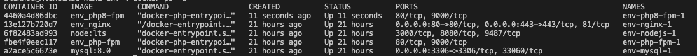

## ENV  
啟動 docker (包含 php-fpm nginx mysql)
```sh
docker-composer up -d 
```
第一次啟動時會拉取 imgage 稍待片刻即可  
啟動後下指令觀察容器啟動狀況會如附圖  
`docker ps -a`
  

[Docker 細節](#docker-細節)

## php-fpm  
容器有兩個, 提供 php7.4 & php8.0 支持同時運行  
名稱為 php-fpm php8-fpm  
實際上使用的版本由 nginx 負責導向  
Dockerfile 請見 [php74](./Docker/php74/Dockerfile) [php80](./Docker/php80/Dockerfile)  
php-extensions 目前以有用到的為主, 如遇專案需要再另行新增  
容器中已經有包含 composer  
各項指令(ex. `composer install` `php artisan migrate`)  
請進入容器中對應資料夾執行  
```sh
docker-compose exec php-fpm bash
cd {proj folder}
## etc
composer install
php artisan migrate
```

## nginx & vhost
所有的 nginx.conf 請放入 `./nginx/conf.d/`  
容器啟動時會自動掛載資料夾進去  
範例檔 [laravel.example](./nginx/conf.d/laravel.example)  
[快速生成 conf 檔案](#快速生成-conf-檔案)  
自行新增的檔案也一樣放在上述資料夾中  

nip.io 是免費的 DNS 服務可以讓你不需要再 /etc/hosts 填入 domain  
mkcert 是快速的 localhost 憑證建立服務  
```sh
brew install mkcert
mkcert "*.127.0.0.1.nip.io"
mkcert -install
```
執行結束後會有兩個憑證請放入 ./nginx/ssl
```
_wildcard.127.0.0.1.nip.io-key.pem
_wildcard.127.0.0.1.nip.io.pem
```

重啟瀏覽器 (chrome 可於網址列填入下方連結)
```url
chrome://restart
```

## 專案  
所有專案統一放在 `./php`  
因為每個人開發專案不同 所以不使用 submodule  


## IDE
phpstorm 參考文件  
https://www.lzskyline.com/index.php/archives/157/  

## Command  
`docker-compose logs -f nginx`  
`docker-compose exec nodejs npm install` 
### test ＆reload nginx conf file
```
docker-compose exec nginx nginx -t
docker-compose exec nginx nginx -s reload 
```
### 快速生成 conf 檔案  
`./add_host.sh <folderName> <containerName>` 
- folderName  資料夾名稱  
- containerName proxy_pass 容器名稱, 預設 php-fpm (php7.4)  

預設的 server_name 會是 {folderName}.127.0.0.1.nip.io  
如果需要調整再自行處理   

ps.請務必進入 nginx 資料夾執行, 不然相對路徑會不對    
ex.
```bash
cd nginx
## php74
./add_host.sh <folderName>
## php80
./add_host.sh <folderName> php8-fpm
```

## 開發規範 
### psr-12
https://www.php-fig.org/psr/psr-12/  

### Docker 細節
**STATUS** 部分會顯示 UP  
**PORTS** 表示該容器port 情況  
各個容器的 port 是互相獨立的, 比方說 php8-fpm 與 php-fpm 的容器 expose 了 80 9000 port 但是沒有映射到本機的 port 上, 就會顯示 `80/tcp, 9000/tcp`  
以 nginx 來說, 因為我們需要從本機(或者其他位置)使用 80 443 port 連線到容器的 80 443 port, 所以就會有`0.0.0.0:80->80/tcp, 0.0.0.0:443->443/tcp`  
mysql 也是一樣的  
php-fpm 實際使用上是由 nginx proxy_pass 到 php-fpm 容器, 只要確保兩個容器的 network 是一致是可以通過 container name 來進行通訊的  
php-fpm 連接 mysql 也是一樣, host 應該填入 mysql 才會連到資料庫的容器, 而非填入 127.0.0.1, 因為這裡的 127.0.0.1 對 php-fpm 來說是自己的容器本身而非使用者的電腦(localhost)    
